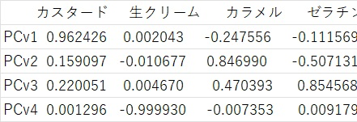

# 主成分ベクトルを引く
1. カスタード、生クリーム、カラメル、ゼラチンの4次元で構成される空間上に散らばるデータを射影すると分散が最大になるようなベクトルを見つけ出す(PC1)
2. PC1に次いでデータの分散を最大化するベクトルPC2を見つけ出す
3. 同様にしてPC3,PC4を見つけ出す
[toydata_pcVector](toydata_pcVector.py)  
### プログラム解説
1. pca.components_ で主成分ベクトルを取り出す。上記のプログラムを実行すると、以下のような主成分ベクトルを表示する。
2. 4次元空間上のベクトルなので4次元座標となっていることに注意。
3. PC1はカスタード座標成分が大きい（この方向にデータが大きく分散しているから）
4. このプログラムではカスタード、カラメル平面上に表示するため、第1,3座標成分を取り出している。



```python 
dataset_df = pd.read_csv('./data/toydata.csv', index_col=0,encoding='ms932', sep=',',skiprows=0)
dataset_df.sample(frac=1, random_state=0)

dataset = dataset_df.values
feature_names = dataset_df.columns 
cls = dataset_df.index

fig, ax = plt.subplots(1, 1, figsize=(6, 4))


colors={'シュークリーム':'red','プリン':'green','杏仁豆腐':'blue'}
syu = dataset[cls=='シュークリーム'] # numpy配列からの条件抽出　なぜこれでシュークリームのデータを取り出せるかを考えよ
ax.scatter(syu[:,0],syu[:,2], c=colors['シュークリーム'],s=100,alpha=0.5,label='シュークリーム')
prin = dataset[cls=='プリン']
ax.scatter(prin[:,0],prin[:,2], c=colors['プリン'],s=100,alpha=0.5,label='プリン')
anin = dataset[cls=='杏仁豆腐']
ax.scatter(anin[:,0],anin[:,2], c=colors['杏仁豆腐'],s=100,alpha=0.5,label='杏仁豆腐')


ax.set_xlabel(feature_names[0],fontsize=14)
ax.set_ylabel(feature_names[2],fontsize=14)               


pca = PCA(n_components=4)#主成分分析の準備 n_components : 主成分ベクトルをいくつ検出するかを表すパラメータ
pca.fit(dataset)# 主成分ベクトルを計算　スライドp.15
colorlist = ['pink','brown','orange','purple']
labels = ['PC1','PC2','PC3','PC4']
# pca.components_で主成分ベクトルを取り出せる
for vector1,c,l in zip(pca.components_,colorlist,labels):
	# 以下の[0] [2]は何を意味するか
    ax.arrow(0,0,vector1[0]*4,vector1[2]*4,width=0.05,head_width=0.1,head_length=0.1,length_includes_head=True,color=c)
    ax.annotate(l,xy=(vector1[0]*4,vector1[2]*4),size=16,color = c)

plt.legend(bbox_to_anchor=(1,0), loc='lower right')
plt.show()

```